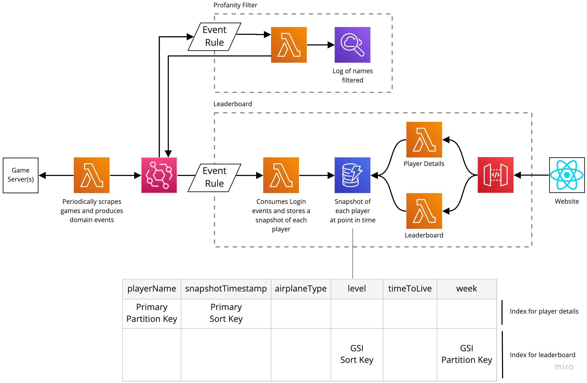

# AirMash Leaderboard

A leaderboard generated by a bot that periodically logs into all the available games and scrapes the details.

The problem with creating a leaderboard for AIRMASH is that there is no way to discern whether two players with the
same name are the same person, since the game allows you to choose any name (regardless of whether someone else might
have used it in the past), and the underlying ID assigned to each player isn't maintained across games.

## Architecture

<p align="center">
  
</p>

## Manual Testing

The following guides you through setting up a copy of AirMash locally with some bots

### Server

Run the [ab-server locally](https://github.com/wight-airmash/ab-server#how-to-run-examples)
by doing the following:

```bash
git clone git@github.com:wight-airmash/ab-server.git
cd ab-server
docker build -t airbattle-server .
docker run -p 3501:3501 -e SERVER_TYPE=FFA -e SU_PASSWORD=mypass airbattle-server
```

Once running it can be connected to at `ws://127.0.0.1:3501/ffa`

### Front-end

Run the [front-end](https://github.com/airmash-refugees/airmash-frontend) locally by doing the following:

1. Setup the project

    ```bash
    git clone git@github.com:airmash-refugees/airmash-frontend.git
    cd airmash-frontend
    ```

2. Update server URL

    Update `customServerUrl` in `Game.js` to the URL of the server.

    If you're hosting the container above then
    this will be `ws://127.0.0.1:3501/ffa`.

3. Build and start the front-end

    ```bash
    DEBUG=1 npm run build && cd dist/ && python3 -m http.server
    ```

4. Navigate to the front-end

    Navigate to `http://127.0.0.1:8000/`. Be sure to go to `127.0.0.1` since the code looks
    for this loopback IP in the host (as opposed to 0.0.0.0) to detect whether it is in development mode
    and thus use the `customServerUrl`.


### Bots

You can simulate a real game by adding some [ab-bots](https://github.com/spatiebot/ab-bot).

```bash
git clone --recurse-submodules git://github.com/spatiebot/ab-bot.git
cd ab-bot
npm i
npx gulp
node dist/app.js --ws=local --num=1 --character=Aggressive --dev
```
